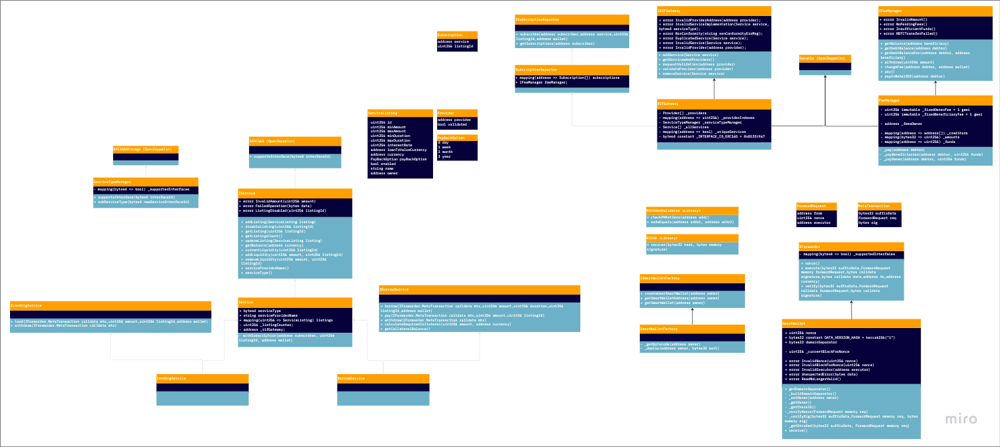

    

<h3 align="middle">RIF Everyday Defi Gateway</h3>

    The RIF Defi Gateway serves as a decentralized intermediary connecting Defi Protocol Service Providers, Consumers, and Wallets.  The key focus is delivering a service/protocol which can support target ecosystems in Everyday Defi.

<h3>contracts architecture</h3>

